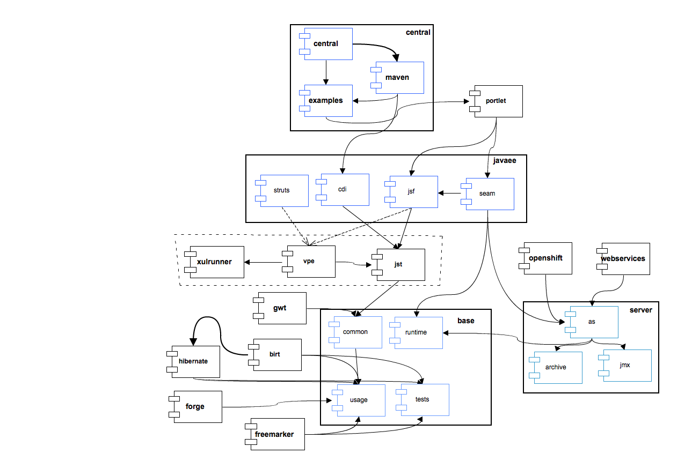

# I hate this split, why can't we just have everything in one big repo ?

There are more than a few reasons for this:

1) The big repository made svn slow - it also makes Git slow (yes, its that big!)

2) We have modules that could just stay untouched between releases, in big repo these had to be rebuilt, in splitup we can move to a build-when-needed approach.

3) A change in git repo will trigger every build on Jenkins - waste builds.
   (yes, we could filter these with SVN but its a mess to maintain)

4) Everyone thinks someone else is taking care of a module in a big repo - now its clear who owns what

5) GitHub pull-requests are awesome. 

6) Easier to contribute to a smaller repo than a big one.

# I think something is missing/wrong in the repository!

Not everything was migrated because some content was old/garbage/not-relevant/not-applicable to the split up.
You can see [JBIDE-12475](https://issues.jboss.org/browse/JBIDE-12475) for discussion and details on how the split was made.

The following is a snapshot from the suggested layout when migration began:

   

<table>
  <th>SVN location</th> <th>GitHub repo</th> <th>Gatekeeper</th> <th>Comments</th>
  <tr>	
   <td>build</td>         <td>jbosstools-parent jbosstools-targetplatform </td>     <td>release engineering</td>  <td>Might not be available from day one</td>
  </tr>
  <tr>
   <td>documentation</td> <td>jbosstools-documentation</td><td>TBD</td>
  </tr>
  <tr>	
   <td>freemarker</td>    <td>jbosstools-freemarker</td><td>TBD</td> 
  </tr>
  <tr>	
   <td>forge</td>         <td>jbosstools-forge</td>     <td>Koen Aers</td>
  </tr>
  <tr>	
   <td>gwt</td>           <td>jbosstools-gwt</td>       <td>Denis Golovin</td>
  </tr>
  <tr>	
   <td>vpe</td>           <td>jbosstools-vpe</td>       <td>Yahor Radtsevich</td>
  </tr>
  <tr>	
   <td>openshift</td>     <td>jbosstools-openshift</td> <td>Andre Dietsheim</td>  
  </tr>
  <tr>	
   <td>jst</td>     <td>jbosstools-jst</td>             <td>Alexey Kazakov</td>  
  </tr>
  <tr>	
   <td>portlet</td>     <td>jbosstools-portlet</td>     <td>Snjezana Peceo (TBD)</td>  <td>Kept on its own since Portal team said they would like to update/replace it</td>
  </tr>
  <tr>	
   <td>ws</td>   <td>jbosstools-webservices</td>        <td>Xavier Coulon (Brian?)</td>  
  </tr>
  <tr>	
   <td>xulrunner</td>   <td>jbosstools-xulrunner</td>   <td>Yahor Radtsevich</td>  
  </tr>
  <tr>	
   <td>hibernatetools</td><td>jbosstools-hibernate</td> <td>Koen Aers (TBD)</td>  <td>renamed from hibernatetools to follow the jbosstools-framework convention.</td> 
  </tr>
  <tr>	
   <td>birt</td>          <td>jbosstools-birt</td>      <td>Snjezana Peco</td>
  </tr>
  <tr>	
   <td>
     cdi 
     jsf 
     seam 
     struts 
   </td>                  <td>jbosstools-javaee</td>    <td>Alexey Kazakov</td>
  </tr>
  <tr>	
   <td>
     common 
     runtime 
     usage 
     tests 
   </td>                  <td>jbosstools-base</td>    <td>TBD (Alexey/Rob?)</td>
  </tr>
  <tr>	
    <td>
      as 
      archives 
      jmx 
     </td>                <td>jbosstools-server</td>    <td>Rob Stryker</td>
   </tr>
   <tr>	
    <td>
     central 
     examples 
     maven 
    </td>                 <td>jbosstools-central</td> <td>Fred Bricon</td>      <td>maven is odd here, but dependencies prevent it to currently move.</td>
   </tr>
</table>

If that does not answer your question then please speak up on [JBoss Tools Mailing list](mailto://jbosstools-dev@lists.jboss.org) and 
we can help locate it or if something is indeed missing resurrect it if need be.

# What happens with the SVN repostory at http://svn.jboss.org/repos/jbosstools ?

It will remain for doing old builds if it ever needs to be done again.

Content of modules in `trunk` that have been migrated to Git will be svn deleteed leaving
only a README.md file pointing to the new home of the repository and the module trunk will
be marked read-only to avoid suprises.

# Is the svn github mirror (https://github.com/jbosstools/jbosstools-svn-mirror) still relevant ?

Since there can be changes made in the SVN repo after our migration in case of builds/fixes needed
for older builds we plan to keep this mirror alive to at least have an easy way to get proper diffs
for merges and comparison.

# Github has issue tracking, can I use that instead of Jira ?

No, we'll continue to use Jira for tracking issues and you'll be happy for it since GitHub issue system
is very limited and weak compared to Jira. 

# Before releng (Nick) would tag and branch the central svn repository, now we have multiple repositories who does the tagging/branching ?

To begin with we will continue doing "global" tagging/branches for the repositories that was part of jbosstools svn repo.
Over time it will be the module owners that should do the tagging/branches for the individual repositories which then gets included into
the overall build. This will be a gradual progress as we get experience and feedback on the move to git/smaller repositories. 

# Why does the history contain git-svn-id in the svn commits ?

We used git-svn to do the initial conversion of svn to git and these lines that look like:

`git-svn-id: https://svn.jboss.org/repos/jbosstools/trunk@43947 a97e2381-89e5-4abb-bab3-167db6db766c`

is metadata git-svn used for tracking its migration.

We could actually remove these but we opted for keeping them in for two reasons:

   1) It allow us to see which exact svn commit a change is from and can use that to look in the svn repo in case we want to explore for possible bad migration data.
   2) svn allows empty commit messages, git does not - if we removed these lines we would have to readjust all the commits that has no message in the history.

 
 

